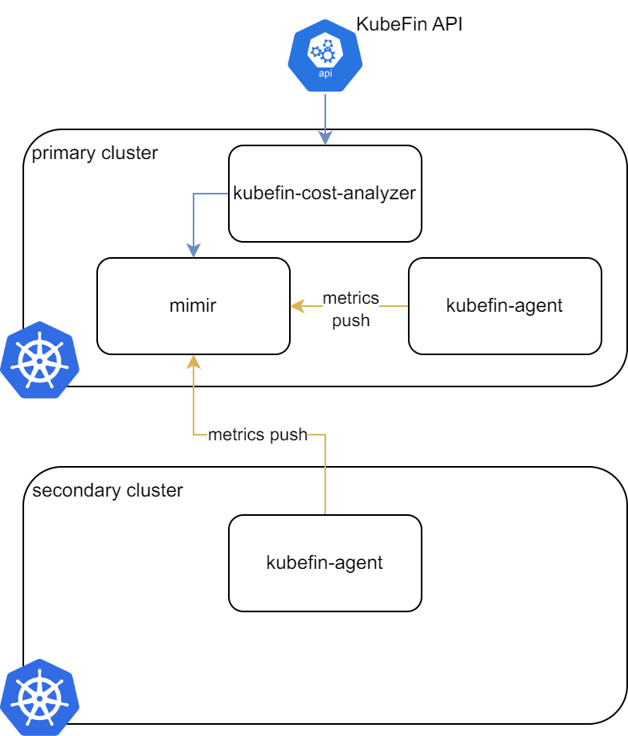
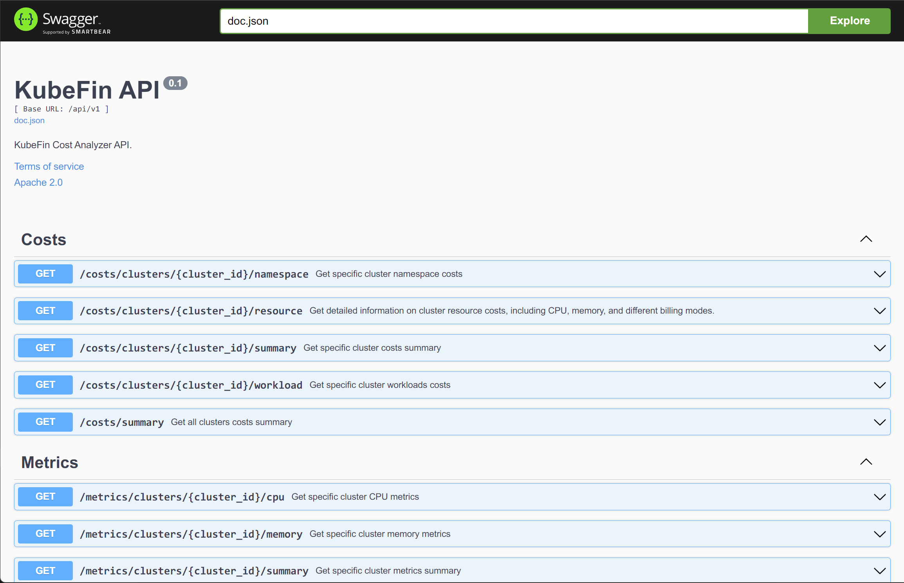

# Development

This doc explains how to set up a development environment so you can get started contributing to `KubeFin`.

## Prerequisites

Follow the instructions below to set up your development environment. Once you meet these requirements, you can make changes and deploy your own version of KubeFin!

### Install requirements

You must install these tools:
1. [`go`](https://golang.org/doc/install): The language `KubeFin` is
   built-in (1.20 or later)
1. [`git`](https://help.github.com/articles/set-up-git/): For source control
1. [`ko`](https://github.com/google/ko): For development.
1. [`kubectl`](https://kubernetes.io/docs/tasks/tools/install-kubectl/): For
   managing development environments.
1. [`bash`](https://www.gnu.org/software/bash/) v4 or later. On macOS the
   default bash is too old, you can use [Homebrew](https://brew.sh) to install a
   later version.
1. [`Docker`](https://www.docker.com/products/docker-desktop/) Make sure your computer has Docker running.

## Local development

### Install kind

Please follow the instructions provided in this [link](https://kind.sigs.k8s.io/docs/user/quick-start/#installing-from-release-binaries) to install kind on your local environment.

### Check out your fork

To check out this repository:

1. Create your own
   [fork of this repo](https://help.github.com/articles/fork-a-repo/)
1. Clone it to your machine:
   ```shell
   git clone https://github.com/${YOUR_GITHUB_USERNAME}/kubefin.git
   cd kubefin
   git remote add upstream https://github.com/kubefin/kubefin.git
   git remote set-url --push upstream no_push
    ```

_Adding the `upstream` remote sets you up nicely for regularly
[syncing your fork](https://help.github.com/articles/syncing-a-fork/)._

Once you reach this point you are ready to do a full build and deploy as described below.

### Start KubeFin

Once you've [set up your development environment](#prerequisites), `KubeFin` can be installed. But before installation, let's checking the testing environment architecture:



* `Primary cluster`: This is where the `mimir`(store metrics) and `kubefin-cost-analyzer` components are deployed.
* `Secondary cluster`: This is where only the `kubefin-agent` component is deployed. The role of the `kubefin-agent` in this cluster is to collect cost data for the cluster and send it to the primary cluster's `mimir` component.

Now, enter the `kubefin` directory and run:
```sh
hack/local-start-kubefin.sh
```

If the installation is successful, you should see the following output:
```sh
...
clusterrole.rbac.authorization.k8s.io/kubefin-cluster-role created
role.rbac.authorization.k8s.io/kubefin-role created
serviceaccount/kubefin-sa created
clusterrolebinding.rbac.authorization.k8s.io/kubefin-cluster-rb created
rolebinding.rbac.authorization.k8s.io/kubefin-rb created
configmap/otel-collector-config created
deployment.apps/kubefin-agent created
[INFO] Run the following command to export the API:
kubectl port-forward -nkubefin svc/kubefin-cost-analyzer-service --kubeconfig=${HOME}/.kube/kubefin-server.config 8080 3000
```

Then, you can see things running with:
```sh
$ kind get clusters
cluster-1
kubefin-server

$ kubectl get pods -nkubefin --kubeconfig=${HOME}/.kube/kubefin-server.config
NAME                                   READY   STATUS    RESTARTS   AGE
grafana-5c9dbbcf5-jl66q                1/1     Running   0          6m54s
kubefin-agent-57475455bb-dq7tl         2/2     Running   0          6m54s
kubefin-cost-analyzer-5455995b-x6k78   1/1     Running   0          6m54s
mimir-0                                1/1     Running   0          6m54s

$ kubectl get pods -nkubefin --kubeconfig=${HOME}/.kube/cluster-1.config
NAME                             READY   STATUS    RESTARTS   AGE
kubefin-agent-557fc846db-ghxpt   2/2     Running   0          4m24s
```

Now, let's try to query the clusters' cost summary:
```sh
# In terminal 1
$ kubectl port-forward -nkubefin service/kubefin-cost-analyzer-service 8080:8080 --address='0.0.0.0' --kubeconfig=${HOME}/.kube/kubefin-server.config

# In terminal 2
$ curl http://localhost:8080/api/v1/costs/summary | jq .
{
  "items": [
    {
      "clusterName": "kubefin-server",
      "clusterId": "6f0e25c8-02a5-45e8-811f-143796dc4907",
      "cloudProvider": "default",
      "clusterRegion": "default_region",
      "lastActiveTime": 1691424828,
      "clusterConnectionSate": "running",
      "clusterActiveTime": 300,
      "clusterMonthCostCurrent": 0.132477658589681,
      "clusterMonthEstimateCost": 1160.5042892456056,
      "clusterAvgDailyCost": 38.15356567382813,
      "ClusterAvgHourlyCoreCost": 0.08
    },
    {
      "clusterName": "cluster-1",
      "clusterId": "96bc6a4b-891d-42b0-9ff0-71fbe9a2f91d",
      "cloudProvider": "default",
      "clusterRegion": "default_region",
      "lastActiveTime": 1691424828,
      "clusterConnectionSate": "running",
      "clusterActiveTime": 240,
      "clusterMonthCostCurrent": 0.10598212687174478,
      "clusterMonthEstimateCost": 1160.5042892456054,
      "clusterAvgDailyCost": 38.15356567382812,
      "ClusterAvgHourlyCoreCost": 0.08
    }
  ]
}
```
There are two clusters in the cost summary: `kubefin-server` as the primary cluster and `cluster-1` as the secondary cluster.

### Checking KubeFin API

After running the following command:
```sh
kubectl port-forward -nkubefin service/kubefin-cost-analyzer-service 8080:8080 --address='0.0.0.0' --kubeconfig=${HOME}/.kube/kubefin-server.config
```

Go to http://localhost:8080/swagger/index.html, you will see all the API of KubFin:




### Iterating

Once you make changes to the code-base, you can redeploy `KubeFin`:
```sh
export KO_DOCKER_REPO=kind.local
# Redeploy in primary cluster(kubefin-agent/kubefin-cost-analyzer)
export KUBECONFIG=${HOME}/.kube/kubefin-server.config
export KIND_CLUSTER_NAME=kubefin-server
ko apply -Rf config_primary

# Redeploy in secondary cluster(kubefin-agent)
export KUBECONFIG=${HOME}/.kube/cluster-1.config
export KIND_CLUSTER_NAME=cluster-1
ko apply -Rf config_secondary
```

If you make any changes related to the API, please run the following command before sumbmitting the PR:
```
swag init -g cmd/kubefin-cost-analyzer/main.go -o docs/ --parseDependency --quiet
```

### Clean up

You can delete all of the things with:
```sh
hack/local-delete-kubefin.sh
```
