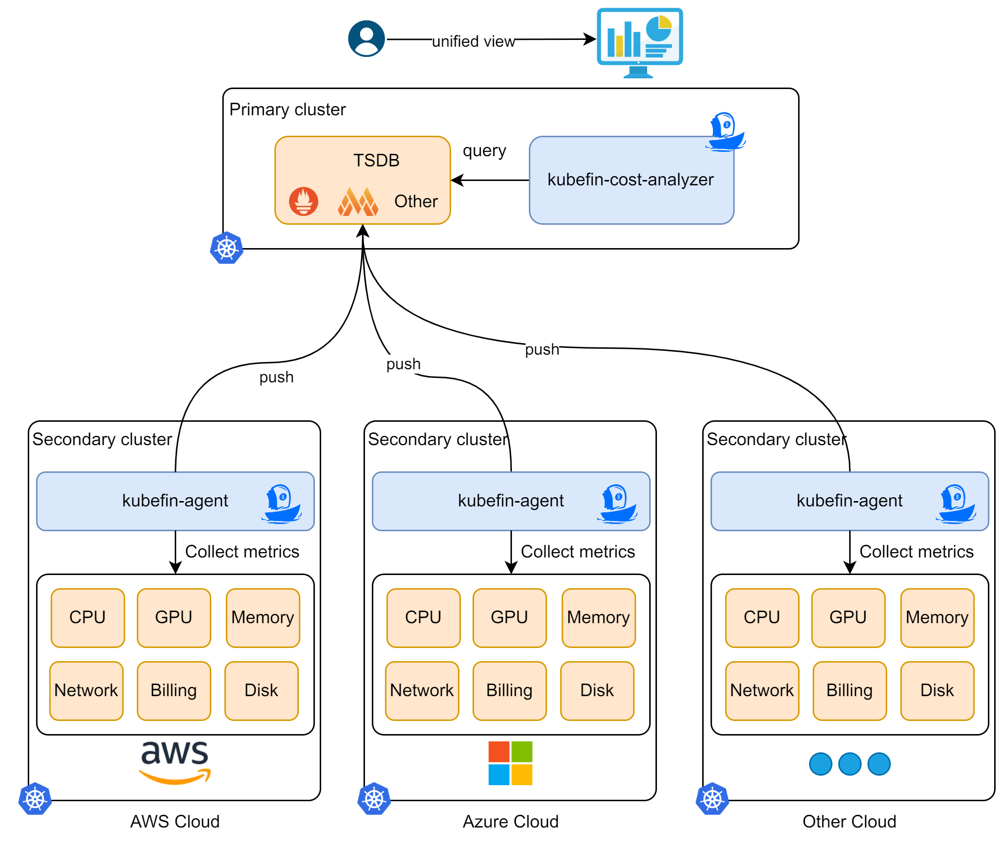
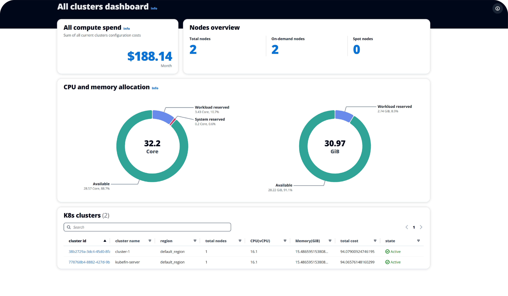
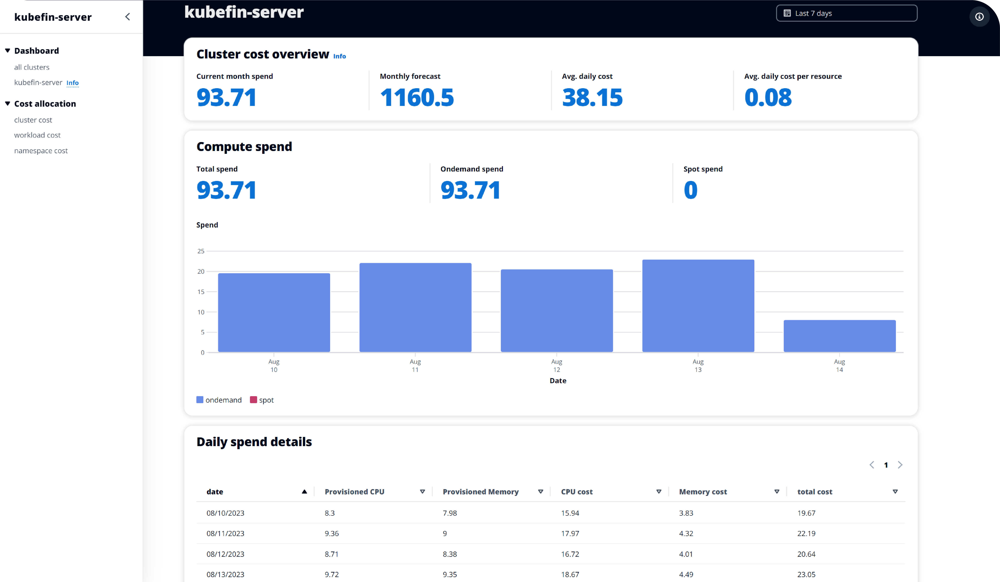

<p align="center">
    
    <br><br>
    <i>Drive the most value from every dollar you invest in the cloud.</i>
</p>

[](https://goreportcard.com/report/github.com/kubefin/kubefin)
[](https://github.com/kubefin/kubefin/blob/main/LICENSE)
[](https://github.com/kubefin/kubefin/releases)
[](https://hub.docker.com/r/kubefin/kubefin-agent)
[](https://www.bestpractices.dev/en/projects/7952)

## Introduction

KubeFin is a platform built on Kubernetes that enables you to efficiently gain insights into and reduce costs for your Kubernetes clusters. With KubeFin, you can effortlessly analyze and minimize your cloud expenses, ensuring optimal utilization of resources.

Currently, the cost insights feature is supported, optimization will be available soon.



## Highlights

Taking care of the cost management for the entire public cloud clusters lifecycle. With rich dimensions of cost insights and optimization strategies, KubeFin enables you to use the cloud in the most cost-effective way.

### Cost insights

Easily view the cost overview of multiple clusters from different clouds in one page. Additionally, KubeFin allows you to dive deeper into the cost details of each cluster by analyzing various dimensions such as nodes, workloads, namespaces and etc.

 

### Optimize Cost automatically(Available soon)

Once KubeFin is installed in clusters, it will analyze cloud resources usage and do right-sizing(CPU/Memory Request right-sizing, EC2 nodes' spec right-sizing and Spot optimization etc) automatically to reduce your cloud cost up to 40%.

### Optimize Cost Continually(Available soon)

KubeFin will continuously profile and categorize workloads within the cluster in detail, enabling each application to be scheduled to the most "suitable" node, to ensure ongoing resource usage optimization and cost optimization.

## Getting Started

Before installing KubeFin, please ensure that the metrics-server is running. If it is not, please execute the following command:
```sh
kubectl apply -f https://github.com/kubernetes-sigs/metrics-server/releases/latest/download/components.yaml
```

To install the latest KubeFin release in primary cluster from the official manifest, execute the following command.
```shell
kubectl apply -f https://github.com/kubefin/kubefin/releases/latest/download/kubefin.yaml
```

Once your KubeFin has been installed, wait for the pod to be ready and port forward with:
```shell
kubectl port-forward -nkubefin svc/kubefin-cost-analyzer-service 8080 3000
```

To verify that the dashboard and server are running, you may access the KubeFin dashboard at `http://localhost:3000`.

For more installation method, please refer to the [KubeFin documentation](https://kubefin.dev).

## Documentation

Full documentation is available on the [KubeFin website](https://kubefin.dev).

## Community

We want your contributions and suggestions! One of the easiest ways to contribute is to participate in discussions on the Github Issues/Discussion, chat on IM or the bi-weekly community calls. For more information on the community engagement, developer and contributing guidelines and more, head over to the KubeFin community repo.

## Contact Us

Reach out with any questions you may have and we'll make sure to answer them as soon as possible!

- Slack: [KubeFin Slack](https://kubefin.slack.com)
- Wechat Group (*Chinese*): Broker wechat to add you into the user group.

  

## Contributing

Check out [DEVELOPMENT](./DEVELOPMENT.md) to see how to develop with KubeFin.

## Report Vulnerability

Security is a first priority thing for us at KubeFin. If you come across a related issue, please send email to [security@kubefin.dev](security@kubefin.dev).

## Code of Conduct

KubeFin adopts [CNCF Code of Conduct](https://github.com/cncf/foundation/blob/master/code-of-conduct.md).
